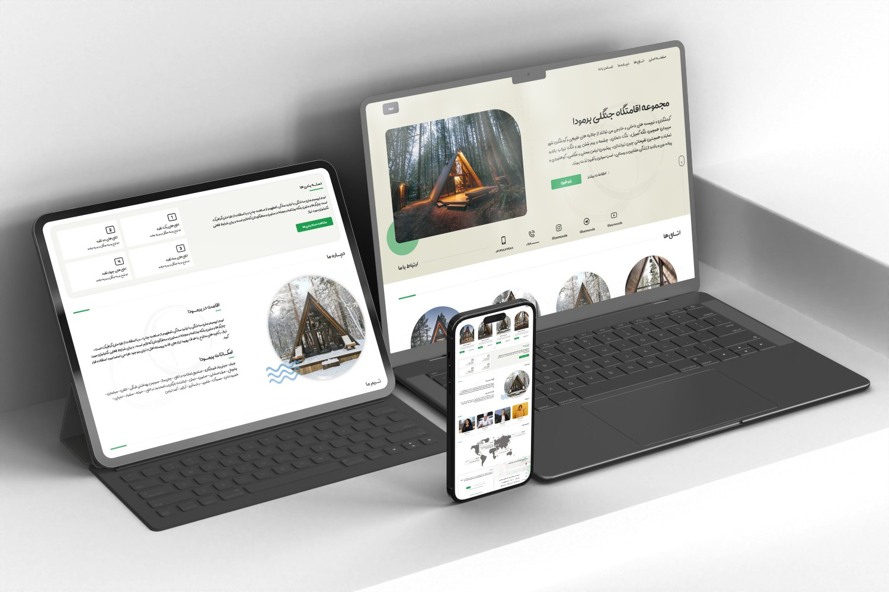

# Hotel Project

This is a hotel website created with **Next.js**, **Material UI**, **SASS**, **Redux-Thunk**, and **Swiper**. \
The website contains several pages that allow users to browse and interact with the hotel's offerings.

## Technologies Used

This project was built using several technologies, including:

- Next.js: For server-side rendering and other optimizations.
- MongoDB: As a cross-platform database.
- Material UI: To make pre-built components for easy styling.
- SASS: A CSS preprocessor.
- Redux-Thunk: A middleware for Redux.
- Swiper: A slider library that allows for smooth scrolling and swiping.

## Pages

- #### Home Page:

  The home page provides an overview of the hotel and an introduction about the hotel and what it offers. It features a large hero image that showcases the hotel's best features and room data as a slider and room category. It also contains about us, our team, what our guests have to say about their experience with the hotel, and the contact us form and the hotel's address.

- #### Rooms Page:

  It contains a comprehensive list of all the rooms. Each room is accompanied by its image, room name, small description, price, and call-to-action button.

- #### Room Page:

  It showcases all the details of each room. You'll find an image of the room, its name, and a detailed description of what it has to offer. It also has a list of room facilities.
  Users also can use like and bookmark buttons if they are already logged in.

- #### Contact Us Page:

  The Contact Us page allows users to get in touch with the hotel. It features a contact form that users can fill out to send a message to the hotel's staff.

- #### Login and Register Page:
  The login and register page allows users to create an account with the hotel. Once logged in, users can bookmark rooms and access other exclusive features.

## Installation

To run this project locally, follow these steps:

1. Clone the repository to your local machine.
2. Install the dependencies by running `npm install`.
3. Start the development server by running `npm run dev`.
4. Navigate to `http://localhost:3000` in your web browser to view the website.

## Conclusion

This hotel website is a great example of how Next.js, Material UI, SASS, Redux-Thunk, and Swiper can be used together to create a beautiful and functional website. \
With its easy-to-use interface and intuitive navigation, this website is sure to attract customers and help them book their next stay at the hotel.

## Author

- [@MehrabVosough](https://github.com/MehrabVosough)
